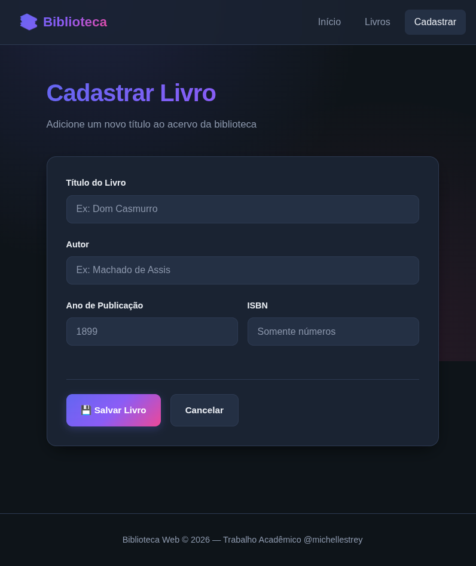
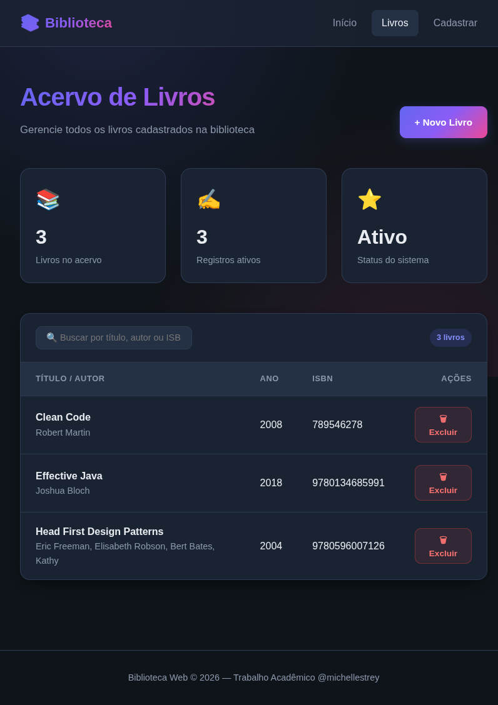
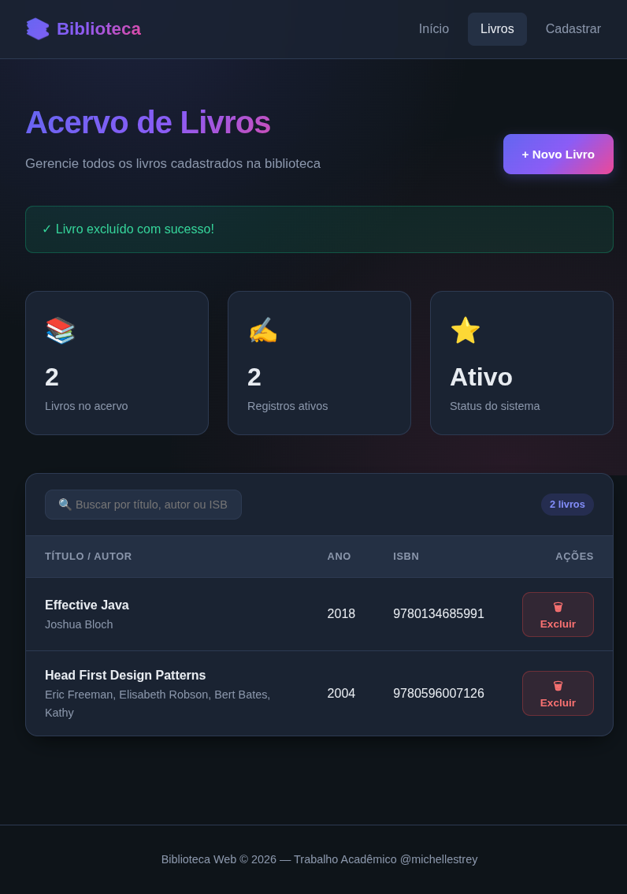

# 📚 Sistema de Biblioteca Web

Sistema web CRUD desenvolvido em Java para gerenciamento de livros, utilizando arquitetura MVC simplificada com JSP/Servlets e persistência em banco de dados relacional via JDBC.

---

## 🧰 Stack Técnica

Java | JSP | Servlets | JDBC | MySQL | Apache Tomcat

---

## 💼 Resumo Técnico

- Desenvolvimento de aplicação web Java utilizando arquitetura MVC simplificada  
- Implementação de operações CRUD completas (Create, Read, Update, Delete)  
- Integração com banco de dados relacional MySQL via JDBC  
- Estruturação em camadas (View, Controller, DAO)  
- Deploy em servidor Apache Tomcat  

---

## 🏗️ Arquitetura

- View: JSP (interface do usuário)  
- Controller: Servlets (controle de requisições e regras de fluxo)  
- DAO: JDBC para acesso a dados  
- Database: MySQL  

---

## ⚙️ Funcionalidades

- Cadastro de livros  
- Listagem de livros  
- Edição de registros  
- Exclusão de registros  

---

## 🔐 Implementações técnicas

- Centralização da conexão com banco via ConnectionFactory  
- Separação de responsabilidades seguindo padrão MVC simplificado  
- Validação de dados no backend  
- Estrutura preparada para evolução para frameworks Java modernos (ex: Spring)  

---

## 🖥️ Front-end

Interface desenvolvida com JSP.  

Parte do layout e ajustes de interface foram auxiliados com ferramenta de geração de UI (Lovable).

---

## ⚠️ Limitações técnicas (contexto acadêmico)

- Sem autenticação de usuários  
- Sem controle de autorização (roles/perfis)  
- Sem mecanismos avançados de segurança web (CSRF/XSS hardening)  
- Sem rate limiting ou controle de tráfego  
- Não projetado para ambiente de produção  

---

## 🎯 Objetivo do projeto

Projeto acadêmico para consolidação de fundamentos em:

- Java Web (Servlets e JSP)  
- Desenvolvimento backend com arquitetura MVC  
- Integração com banco de dados relacional  
- Construção de aplicações CRUD  

---

## 📷 Interface do Sistema

### Home

### Cadastro de livros

### Listagem de livros

### Exclusão de livros

